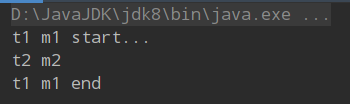

Java关于线程的相关知识，马士兵老师的高并发编程系列[av11076511](https://www.bilibili.com/video/av11076511)，知识点2

<!--more-->

# 死锁

死锁是指两个或两个以上的线程在执行过程中，由于竞争资源或者由于彼此通信而造成的一种阻塞的现象，若无外力作用，它们都将无法推进下去。此时称系统处于死锁状态或系统产生了死锁，这些永远在互相等待的进程称为死锁进程。

## 产生死锁的必要条件

### 1.互斥条件

资源是独占的且排他使用。进程互斥使用资源，即任一时刻一个资源只能给一个进程使用，其他进程若申请一个资源，而该资源被另一个进程占有时，则申请等待，直到该资源被占用者释放

### 2.不可剥夺条件

进程所获得的资源在未使用完毕之前，不能被其他进程强行剥夺，而只能由获得该资源的进程自愿释放

### 3.请求与保持条件

进程每次申请它所需要的一部分资源，在申请新资源的同时，继续占用已分配到的资源

### 4.循环等待条件

在发生死锁时，必然存在一个进程等待队列（P1,P2,P3....Pn），其中P1等待P2占有的资源，P2等待P1占有的资源，形成了一个进程等待环路。环路中每个进程已占有的资源同时被另一个进程所申请，即前一个进程占有后一个进程所申请的资源


## 代码模拟死锁

```java
/*
* 线程1 先锁定对象a 3s后申请b
* 线程2 先锁定对象b 3s后申请a
* 进程无法继续推进 导致死锁问题
*/
public class T {
 
    Object a = new Object();
    Object b = new Object();
 
    public void m1() {
        synchronized (a) {
            try {
                Thread.sleep(3000);
            } catch (InterruptedException e) {
                e.printStackTrace();
            }
            synchronized (b) {
                System.out.println("success1");
            }
        }
    }
 
    public void m2() {
        synchronized (b) {
            try {
                Thread.sleep(3000);
            } catch (InterruptedException e) {
                e.printStackTrace();
            }
            synchronized (a) {
                System.out.println("success2");
            }
        }
    }
 
    public static void main(String[] args) {
        T t = new T();
        new Thread(t::m1, "t1").start();
        new Thread(t::m2, "t2").start();
    }
}

```

# 同步方法和非同步方法是否可以同时调用？

同步方法m1和非同步方法m2，被两个线程分别调用

问：m2方法是否需要等待m1方法执行完之后再执行

### 代码如下：

```java
public class T {
    
	public synchronized void m1() { 
		System.out.println(Thread.currentThread().getName() + " m1 start...");
		try {
			Thread.sleep(10000);
		} catch (InterruptedException e) {
			e.printStackTrace();
		}
		System.out.println(Thread.currentThread().getName() + " m1 end");
	}
	
	public void m2() {
		try {
			Thread.sleep(5000);
		} catch (InterruptedException e) {
			e.printStackTrace();
		}
		System.out.println(Thread.currentThread().getName() + " m2 ");
	}
	
	public static void main(String[] args) {
		T t = new T();
		new Thread(t::m1, "t1").start();
		new Thread(t::m2, "t2").start();
		
	}
	
}   
```

### 结果如下：



说明：同步方法和非同步方法可以同时调用

原因：只有被`synchronized`关键字修饰的方法在执行时才需要获得锁，没被修饰则不需要，所以m2执行并不需要先获得锁再执行