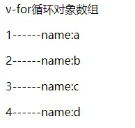
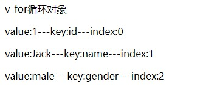

# Vue笔记 Day3

## Vue中使用样式-css

假设`<style>`标签中有样式，如下

```html
<style>
        .red{
            color: red;
        }
        .thin{
            font-weight: 200;
        }
        .italic{
            font-style: italic;
        }
        .active{
            letter-spacing: 0.5em;
        }
    </style>
```

<!--more-->

### 第一种方式

**直接传递一个数组， 注意：这里的class需要使用 v-blind做数组绑定**

```html
 <h1 :class="['thin', 'italic']">it's a Huge H1</h1> 
```

**还可以在数组中使用三元表达式，如**

```html
<h1 :class="['thin', 'italic', flag?'active':'']">it's a Huge h1</h1> 
<!--flag为data中定义的数据-->
```

**在数组中可以用对象替换三元表达式**

```html
<h1 :class="['thin', 'italic', {'active':flag }]">it's a Huge h1</h1>
```

**直接使用对象**

```html
<!--v-bind绑定class的时候，对象的属性是类名，由于对象的属性可带引号，也可以不带引号,属性的值是一个标识符-->
<h1 :class="{red:true, thin:true, italic:false, active:false}">it's a Huge h1</h1>
```

### 第二种方式

**在`style`中书写**

```html
 <h1 :style="{color:'red', 'font-weight': 200 }">This is a h1</h1>
```

**定义在`data`中**

```html
<h1 :style="styleObj1">This is a h1</h1>
```

**用数组的形式，将`style`放入其中**

```html
<h1 :style="[styleObj1, styleObj2]">This is a h1</h1>
```

```javascript
new Vue(
  {
   el:'#app',
   data:{
   styleObj1:{
   color: 'red',
   'font-weight': 200
   },
     styleObj2:{
     'font-style': 'italic',
      }
   }
```

## v-for循环数组，对象数组，对象...

假设有数组，对象数组，对象如下：

```javascript
new Vue({
    el: '#app',
    data: {
    list1:[1,2,3,4,5,6],

     list2:[
           {id:1, name:'a'},
            {id:2, name:'b'},
            {id:3, name:'c'},
            {id:4, name:'d'},
            ],
      user:{
            id:1,
            name: 'Jack',
            gender: 'male',
			}
     }
```

**v-for循环数组**

```html
<!--item为每一项的值，i为每一项的下标-->
<p v-for="(item, i) in list1">{{item}}------index:{{i}}</p>
```


**v-for循环对象数组**

```html
<p v-for="usr in list2">{{ usr.id }}------name:{{ usr.name }}</p>
```



**v-for循环对象**

```html
<p v-for="(val, key, index) in user">value:{{val}}---key:{{key}}--index:{{index}}</p>
```



**v-for迭代数字**

```html
<p v-for="count in 10">loop{{count}}</p>
```

